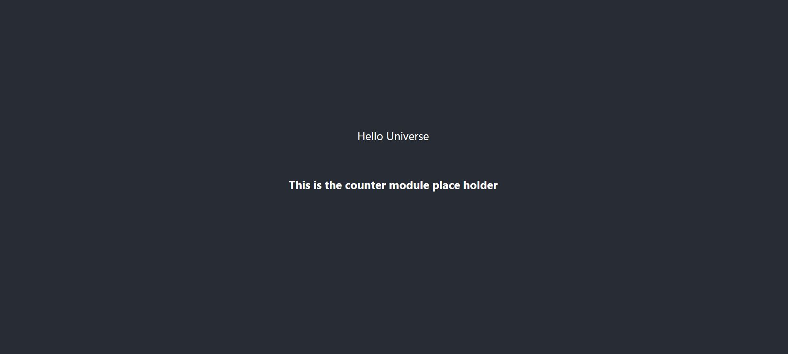

# The [ffc-js-client-side-sdk demo](https://github.com/feature-flags-co/ffc-js-client-side-sdk) for Vue
[中文 README](README.md)

## Integrate SDK into Vue project
1. Install SDK
```
npm install ffc-js-client-side-sdk --save 
```
2. Copy src/ffc folder into your project，open src/ffc/config.js and replace **secret** with your own secret
```javascript
export const option = {
    secret: "USE_YOUR_ENVIRONMENT_SECRET", // replace with your own secret
    anonymous: false,
    user: { // replace with your user
        id: 'my-user',
        userName: 'my user',
        email: '',
        customizedProperties: [
            {
                "name": "sex",
                "value": "male"
            }]
    },
    devModePassword: 'thisisademo' // set dev mode password, not mandatory
}
```

3. Call the following method to change the user
```
ffcClient.identify(user);
```
4. Use the following code to use feature flags
```js
<script>
import { ffcStore } from "./ffc";
</script>

<template>
  <div className="App">
    <header className="App-header">
      <div>Hello {{ffcStore.flags["hello"]}} </div>
      <Counter v-if="ffcStore.flags['counter'] === 'true'"/>
    </header>
  </div>
</template>
```

For more details about the SDK, please the [SDK readme](https://github.com/feature-flags-co/ffc-js-client-side-sdk)

## Get started
1. Go to [https://portal.featureflag.co](https://portal.featureflag.co) create your project
2. Create two flags in your environment
    1. **hello** with two options: **World** and **Universe**
       
    2. **counter** with two options: **true** and **false**
       


3. Open src/ffc/config.js and fill the secret with your environment secret
```javascript
export const option = {
    secret: "USE_YOUR_ENVIRONMENT_SECRET", // replace with your won secret
    anonymous: false,
    user: { // you can keep this
        id: 'my-user',
        userName: 'my user',
        email: '',
        customizedProperties: [
            {
                "name": "sex",
                "value": "male"
            }]
    },
    devModePassword: 'thisisademo'
}


```

4. Run
```
npm install
npm run dev
```

5. Results:
    1. Hello World
       
    2. Hello Universe
       
    1. Activate counter module
       


