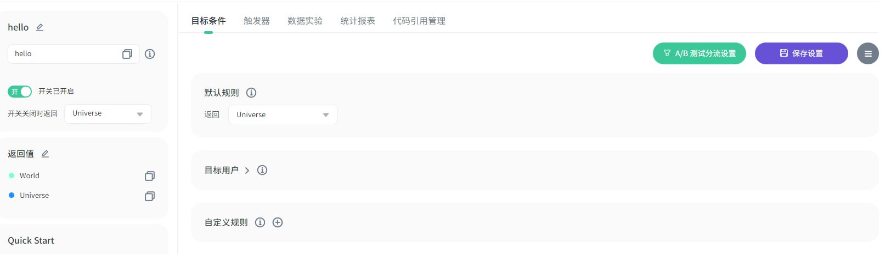
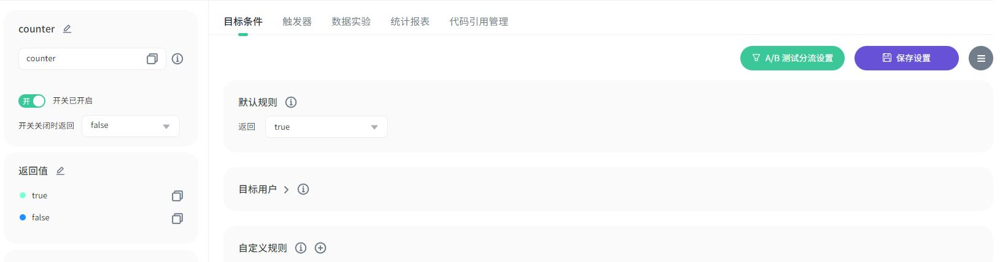
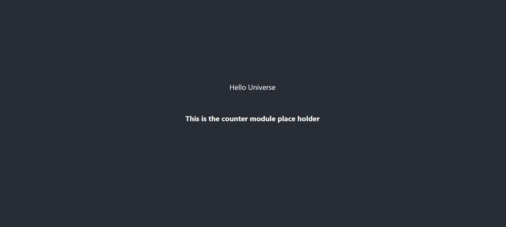

# 敏捷开关 Vue3 [ffc-js-client-side-sdk demo](https://github.com/feature-flags-co/ffc-js-client-side-sdk)
[English README](README-EN.md)

## 设置
1. 前往 [https://portal.featureflag.co](https://portal.featureflag.co) 创建项目和环境
2. 在环境中创建两个开关
    1. **hello** : 两个返回值，分别为 **World** 和 **Universe**
       
    2. **counter** : 两个返回值，非别为 **true** 和 **false**
       


3. 打开 src/ffc/config.js 文件并且将 secret 替换为您自己环境的 secret
```javascript
export const option = {
    secret: "USE_YOUR_ENVIRONMENT_SECRET", // 替换为自己环境的 secret
    anonymous: false,
    user: { // 运行 demo 时可以不用改
        id: 'my-user',
        userName: 'my user',
        email: '',
        customizedProperties: [
            {
                "name": "sex",
                "value": "male"
            }]
    },
    devModePassword: 'thisisademo' // 激活开发者模式的密码，非必须
}
```

4. 运行程序
```
npm install
npm run dev
```

5. 运行结果:
    1. Hello World
       
    2. Hello Universe
       
    3. 激活 counter 模块
       
